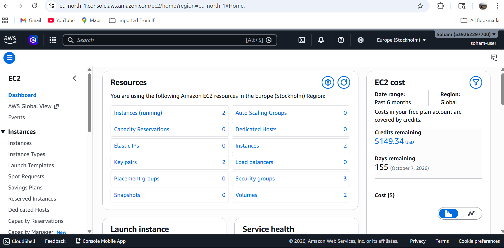
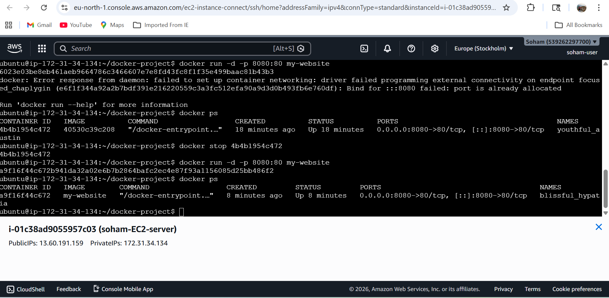
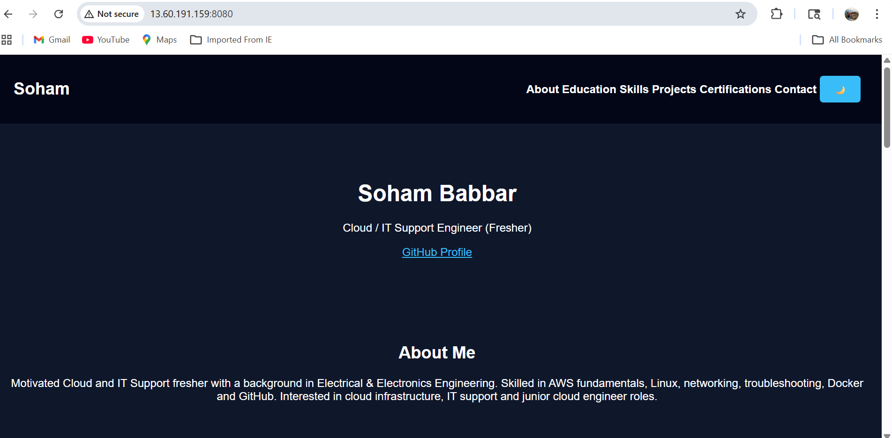

# Dockerized Application Deployment on EC2

## 📌 Project Overview

Containerized and deployed an application on AWS EC2 using Docker.

## 🚀 Technologies Used

* AWS EC2
* Docker
* Linux (Ubuntu)
* Nginx
* HTML, CSS, JavaScript

## ⚙️ Steps Performed

1. Launched EC2 instance
2. Connected via SSH
3. Installed Docker
4. Created Dockerfile
5. Built Docker image
6. Ran container on port 8080

## 🌐 Live Output

http://13.60.191.159:8080

## 📸 Screenshots

### EC2 Instance

### Docker Container Running

### Website Output

